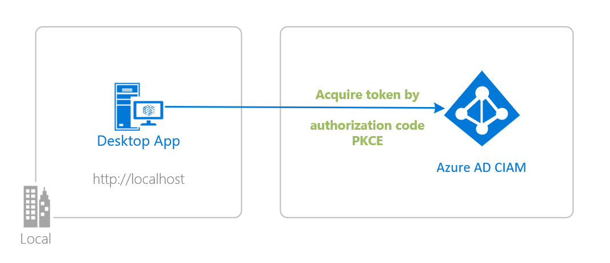
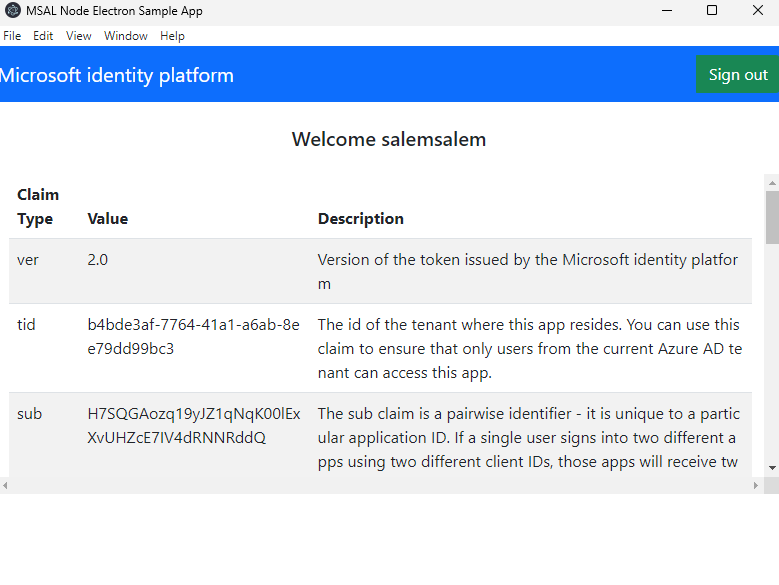

# An Electron desktop application secured by MSAL Node on Microsoft identity platform

* [Overview](#overview)
* [Scenario](#scenario)
* [Contents](#contents)
* [Prerequisites](#prerequisites)
* [Setup the sample](#setup-the-sample)
* [Explore the sample](#explore-the-sample)
* [Troubleshooting](#troubleshooting)
* [About the code](#about-the-code)
* [Next Steps](#next-steps)
* [Contributing](#contributing)
* [Learn More](#learn-more)

## Overview

This sample demonstrates an Electron application that authenticates users against [Customer Identity Access Management](https://github.com/microsoft/entra-previews/tree/PP2/docs) (CIAM), using the [Microsoft Authentication Library for Node](https://github.com/AzureAD/microsoft-authentication-library-for-js/tree/dev/lib/msal-node/docs) (MSAL Node).

Here you'll learn how to sign-in users and acquire [ID tokens](https://docs.microsoft.com/azure/active-directory/develop/id-tokens).

## Scenario

1. The client Electron desktop app uses the  to sign-in a user and obtain a JWT [ID Token](https://aka.ms/id-tokens) and an [Access Token](https://aka.ms/access-tokens) from **Azure AD CIAM**.
1. The **access token** is used as a *bearer* token to authorize the user to call the Microsoft Graph protected by **Azure AD CIAM**.



## Contents

| File/folder                  | Description                                                  |
|------------------------------|--------------------------------------------------------------|
| `AppCreationScripts/`        | Contains Powershell scripts for automating app registration. |
| `App/authProvider.js`        | Main authentication logic resides here.                      |
| `App/main.js`                | Application main process.                                    |
| `App/renderer.js`            | Renderer processes and UI methods.                           |
| `App/constants.js`           | Example user accounts in JSON .                              |
| `App/preload.js`             | Give the Renderer process controlled access to some Node API.|
| `App/authConfig.js`          | Configuration objects to be passed to MSAL instance.         |

## Prerequisites

* [Node.js](https://nodejs.org/en/download/) must be installed to run this sample.
* [Visual Studio Code](https://code.visualstudio.com/download) is recommended for running and editing this sample.
* [VS Code Azure Tools](https://marketplace.visualstudio.com/items?itemName=ms-vscode.vscode-node-azure-pack) extension is recommended for interacting with Azure through VS Code Interface.
* A modern web browser.
* An **Azure AD CIAM** tenant. For more information, see: [How to get an Azure AD CIAM tenant](https://github.com/microsoft/entra-previews/blob/PP2/docs/1-Create-a-CIAM-tenant.md)
* A user account in your **Azure AD CIAM** tenant.

>This sample will not work with a **personal Microsoft account**. If you're signed in to the [Azure portal](https://portal.azure.com) with a personal Microsoft account and have not created a user account in your directory before, you will need to create one before proceeding.

## Setup the sample

### Step 1: Clone or download this repository

From your shell or command line:

```console
git clone https://github.com/Azure-Samples/ms-identity-ciam-javascript-tutorial.git.git
```

or download and extract the repository *.zip* file.

> :warning: To avoid path length limitations on Windows, we recommend cloning into a directory near the root of your drive.

### Step 2: Install project dependencies

```console
    cd 1-Authentication\3-sign-in-electron\App
    npm install
```

### Step 3: Register the sample application(s) in your tenant

There is one project in this sample. To register it, you can:

* follow the steps below for manually register your apps
* or use PowerShell scripts that:
  * **automatically** creates the Azure AD applications and related objects (passwords, permissions, dependencies) for you.
  * modify the projects' configuration files.

<details>
   <summary>Expand this section if you want to use this automation:</summary>

> :warning: If you have never used **Microsoft Graph PowerShell** before, we recommend you go through the [App Creation Scripts Guide](./AppCreationScripts/AppCreationScripts.md) once to ensure that your environment is prepared correctly for this step.
  
1. On Windows, run PowerShell as **Administrator** and navigate to the root of the cloned directory
1. In PowerShell run:

    ```PowerShell
    Set-ExecutionPolicy -ExecutionPolicy RemoteSigned -Scope Process -Force
    ```

1. Run the script to create your Azure AD application and configure the code of the sample application accordingly.
1. For interactive process -in PowerShell, run:

    ```PowerShell
    cd .\AppCreationScripts\
    .\Configure.ps1 -TenantId "[Optional] - your tenant id" -AzureEnvironmentName "[Optional] - Azure environment, defaults to 'Global'"
    ```

> Other ways of running the scripts are described in [App Creation Scripts guide](./AppCreationScripts/AppCreationScripts.md). The scripts also provide a guide to automated application registration, configuration and removal which can help in your CI/CD scenarios.

</details>

#### Choose the Azure AD CIAM tenant where you want to create your applications

To manually register the apps, as a first step you'll need to:

1. Sign in to the [Azure portal](https://portal.azure.com).
1. If your account is present in more than one Azure AD CIAM tenant, select your profile at the top right corner in the menu on top of the page, and then **switch directory** to change your portal session to the desired Azure AD CIAM tenant.

#### Create User Flows

Please refer to: [Tutorial: Create user flow in Azure Active Directory CIAM](https://github.com/microsoft/entra-previews/blob/PP2/docs/3-Create-sign-up-and-sign-in-user-flow.md)

> :information_source: To enable password reset in Customer Identity Access Management (CIAM) in Azure Active Directory (Azure AD), please refer to: [Tutorial: Enable self-service password reset](https://github.com/microsoft/entra-previews/blob/PP2/docs/4-Enable-password-reset.md)

#### Add External Identity Providers

Please refer to:

* [Tutorial: Add Google as an identity provider](https://github.com/microsoft/entra-previews/blob/PP2/docs/6-Add-Google-identity-provider.md)
* [Tutorial: Add Facebook as an identity provider](https://github.com/microsoft/entra-previews/blob/PP2/docs/7-Add-Facebook-identity-provider.md)

#### Register the client app (msal-node-desktop)

1. Navigate to the [Azure portal](https://portal.azure.com) and select the **Azure AD CIAM** service.
1. Select the **App Registrations** blade on the left, then select **New registration**.
1. In the **Register an application page** that appears, enter your application's registration information:
    1. In the **Name** section, enter a meaningful application name that will be displayed to users of the app, for example `msal-node-desktop`.
    1. Under **Supported account types**, select **Accounts in this organizational directory only**
    1. Select **Register** to create the application.
1. In the **Overview** blade, find and note the **Application (client) ID**. You use this value in your app's configuration file(s) later in your code.
1. In the app's registration screen, select the **Authentication** blade to the left.
1. If you don't have a platform added, select **Add a platform** and select the **Public client (mobile & desktop)** option.
    1. In the **Redirect URIs** | **Suggested Redirect URIs for public clients (mobile, desktop)** type in the value **http://localhost**
    1. In the **Redirect URI** section enter the following redirect URI `http://localhost`.
    1. Click **Save** to save your changes.
1. Since this app signs-in users, we will now proceed to select **delegated permissions**, which is is required by apps signing-in users.
    1. In the app's registration screen, select the **API permissions** blade in the left to open the page where we add access to the APIs that your application needs:
    1. Select the **Add a permission** button and then:
    1. Ensure that the **Microsoft APIs** tab is selected.
    1. In the *Commonly used Microsoft APIs* section, select **Microsoft Graph**
    1. In the **Delegated permissions** section, select **openid**, **offline_access** in the list. Use the search box if necessary.
    1. Select the **Add permissions** button at the bottom.
1. At this stage, the permissions are assigned correctly, but since it's a CIAM tenant, the users themselves cannot consent to these permissions. To get around this problem, we'd let the [tenant administrator consent on behalf of all users in the tenant](https://docs.microsoft.com/azure/active-directory/develop/v2-admin-consent). Select the **Grant admin consent for {tenant}** button, and then select **Yes** when you are asked if you want to grant consent for the requested permissions for all accounts in the tenant. You need to be a tenant admin to be able to carry out this operation.

##### Configure Optional Claims

1. Still on the same app registration, select the **Token configuration** blade to the left.
1. Select **Add optional claim**:
    1. Select **optional claim type**, then choose **ID**.
    1. Select the optional claim **login_hint**.
    > An opaque, reliable login hint claim. This claim is the best value to use for the login_hint OAuth parameter in all flows to get SSO.See [optional claims](https://docs.microsoft.com/azure/active-directory/develop/active-directory-optional-claims) for more details on this optional claim.
    1. Select **Add** to save your changes.

##### Configure the client app (msal-node-desktop) to use your app registration

Open the project in your IDE (like Visual Studio or Visual Studio Code) to configure the code.

> In the steps below, "ClientID" is the same as "Application ID" or "AppId".

1. Open the `App\authConfig.js` file.
1. Find the key `Enter_the_Tenant_Info_Here` and replace the existing value with your Azure AD tenant/directory ID.
1. Find the key `Enter_the_Application_Id_Here` and replace the existing value with the application ID (clientId) of `msal-node-desktop` app copied from the Azure portal.

### Step 4: Running the sample

```console
    cd 1-Authentication\3-sign-in-electron\App
    npm start
```

## Explore the sample

1. After running the sample, the desktop app window will appear automatically.
1. Select the **Sign In** button in the top right.


> :information_source: Did the sample not work for you as expected? Then please reach out to us using the [GitHub Issues](../../../../issues) page.

## We'd love your feedback!

Were we successful in addressing your learning objective? Consider taking a moment to [share your experience with us](Enter_Survey_Form_Link).

## Troubleshooting

<details>
	<summary>Expand for troubleshooting info</summary>

> * Use [Stack Overflow](http://stackoverflow.com/questions/tagged/msal) to get support from the community. Ask your questions on Stack Overflow first and browse existing issues to see if someone has asked your question before.
Ask your questions on Stack Overflow first and browse existing issues to see if someone has asked your question before.
Make sure that your questions or comments are tagged with [`azure-active-directory-b2c` `node` `ms-identity` `adal` `msal-js` `msal`].

To provide feedback on or suggest features for Azure Active Directory, visit [User Voice page](https://feedback.azure.com/d365community/forum/79b1327d-d925-ec11-b6e6-000d3a4f06a4).
</details>

## About the code

### Initialization

In order to use MSAL Node, we instantiate the [PublicClientApplication](https://azuread.github.io/microsoft-authentication-library-for-js/ref/classes/_azure_msal_node.publicclientapplication.html) class as shown in the [AuthProvider.js](./App/AuthProvider.js) class.

```javascript

constructor(msalConfig) {
        /**
         * Initialize a public client application. For more information, visit:
         * https://github.com/AzureAD/microsoft-authentication-library-for-js/blob/dev/lib/msal-node/docs/initialize-public-client-application.md
         */
        this.msalConfig = msalConfig;
        this.clientApplication = new PublicClientApplication(this.msalConfig);
        this.cache = this.clientApplication.getTokenCache();
        this.account = null;
    }

```

### Sign-in

MSAL Node exposes two APIs: `acquireTokenSilent()`, `acquireTokenInteractive()` to authenticate the user and acquire tokens. Using the [acquireTokenInteractive](https://azuread.github.io/microsoft-authentication-library-for-js/ref/modules/_azure_msal_node.html#authorizationcoderequest) API, the desktop application starts the [Authorization code flow with PKCE flow](https://docs.microsoft.com/azure/active-directory/develop/v2-oauth2-auth-code-flow) by launching and navigating the system browser to authorization code URL and listens for the authorization code response via loopback server. Once the code is received successfully, `acquireTokenInteractive` will load the assigned **successTemplate**.

```javascript
async getTokenInteractive(tokenRequest) {
        try {
            const openBrowser = async (url) => {
                await shell.openExternal(url);
            };

            const authResponse = await this.clientApplication.acquireTokenInteractive({
                ...tokenRequest,
                openBrowser,
                successTemplate: '<h1>Successfully signed in!</h1> <p>You can close this window now.</p>',
                errorTemplate: '<h1>Oops! Something went wrong</h1> <p>Check the console for more information.</p>',
            });

            return authResponse;
        } catch (error) {
            throw error;
        }
    }
```

After authenticating the user successfully, MSAL Node will cache the tokens in memory for future usage. MSAL Node manages the token lifetime and refreshes for you. APIs like `acquireTokenSilent()` retrieve the access tokens from the cache for a given account, as shown below:

```javascript
async getTokenSilent(tokenRequest) {
        try {
            return await this.clientApplication.acquireTokenSilent(tokenRequest);
        } catch (error) {
            if (error instanceof InteractionRequiredAuthError) {
                console.log('Silent token acquisition failed, acquiring token interactive');
                return await this.getTokenInteractive(tokenRequest);
            }

            console.log(error);
        }
    }
```

### Sign-out

Use the [logout endpoint](https://learn.microsoft.com/azure/active-directory/develop/v2-protocols-oidc#send-a-sign-out-request) to end the user's session with **Azure AD CIAM**. You'll need to enable the [optional token claim](https://learn.microsoft.com/azure/active-directory/develop/active-directory-optional-claims) 'login_hint' to work as expected. After that, we will use the `removeAccount()` API to remove the user account from the in-memory cache.

```javascript
async logout() {
        if (!this.account) return;

        try {
            if (this.account.idTokenClaims.hasOwnProperty('login_hint')) {
                await shell.openExternal(
                    `${this.msalConfig.auth.authority}/oauth2/v2.0/logout?logout_hint=${encodeURIComponent(
                        this.account.idTokenClaims.login_hint
                    )}`
                );
            }

            await this.cache.removeAccount(this.account);
            this.account = null;
        } catch (error) {
            console.log(error);
        }
    }
```

## Next Steps

Learn how to:

> * Enter next steps (samples, docs) for your platform here

## Contributing

If you'd like to contribute to this sample, see [CONTRIBUTING.MD](/CONTRIBUTING.md).

This project has adopted the [Microsoft Open Source Code of Conduct](https://opensource.microsoft.com/codeofconduct/). For more information, see the [Code of Conduct FAQ](https://opensource.microsoft.com/codeofconduct/faq/) or contact [opencode@microsoft.com](mailto:opencode@microsoft.com) with any additional questions or comments.

## Learn More

* [Customize the default branding](https://github.com/microsoft/entra-previews/blob/PP2/docs/5-Customize-default-branding.md)
* [OAuth 2.0 device authorization grant flow](https://github.com/microsoft/entra-previews/blob/PP2/docs/9-OAuth2-device-code.md)
* [Customize sign-in strings](https://github.com/microsoft/entra-previews/blob/PP2/docs/8-Customize-sign-in-strings.md)
* [Building Zero Trust ready apps](https://aka.ms/ztdevsession)
* [Initialize client applications using MSAL.js](https://docs.microsoft.com/azure/active-directory/develop/msal-js-initializing-client-applications)
* [Single sign-on with MSAL.js](https://docs.microsoft.com/azure/active-directory/develop/msal-js-sso)
* [Handle MSAL.js exceptions and errors](https://docs.microsoft.com/azure/active-directory/develop/msal-handling-exceptions?tabs=javascript)
* [Logging in MSAL.js applications](https://docs.microsoft.com/azure/active-directory/develop/msal-logging?tabs=javascript)
* [Pass custom state in authentication requests using MSAL.js](https://docs.microsoft.com/azure/active-directory/develop/msal-js-pass-custom-state-authentication-request)
* [Prompt behavior in MSAL.js interactive requests](https://docs.microsoft.com/azure/active-directory/develop/msal-js-prompt-behavior)
* [Use MSAL.js to work with Azure AD B2C](https://docs.microsoft.com/azure/active-directory/develop/msal-b2c-overview)
